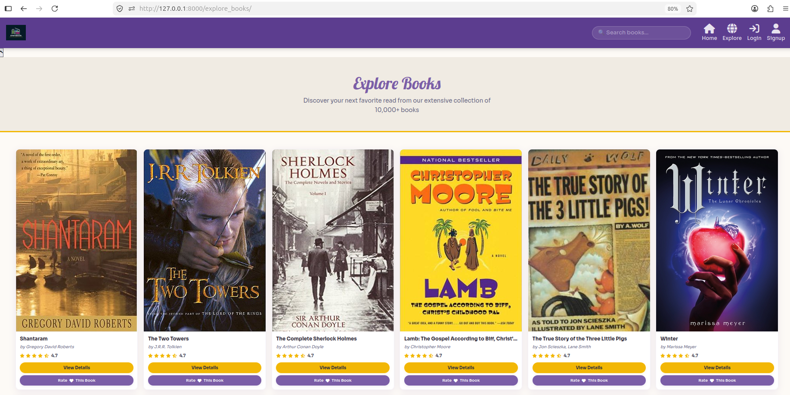
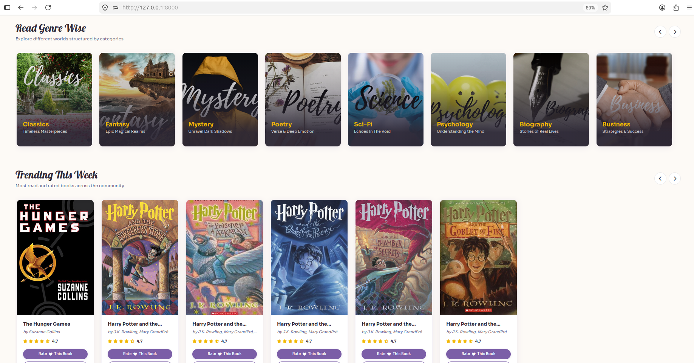
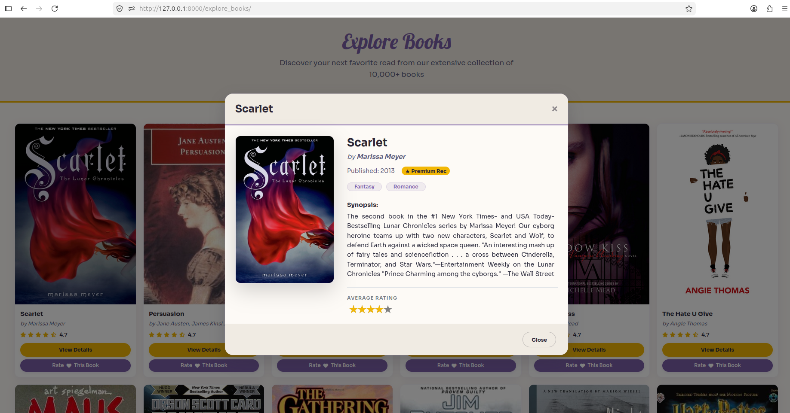

# SynthBook 📖

**An Intelligent Book Recommendation System**

A modern, full-featured book recommendation platform built with **Django** and **Machine Learning**. SynthBook helps readers discover their next favorite book through personalized recommendations using Collaborative Filtering, Content-Based Filtering, and advanced techniques like Embedding Matrix and Cosine Similarity.


---

## ✨ Project Overview

SynthBook is a **Bachelor of Engineering** final year project developed by students of **Cosmos College of Management & Technology** (Affiliated to Pokhara University). It aims to solve the common problem of readers struggling to find books that match their interests by providing intelligent, personalized recommendations.

### Key Features

- **Personalized Recommendations** using Collaborative Filtering (SVD/Embedding Matrix)
- **Genre-wise Book Discovery** with weighted rating system
- **Content-Based Filtering** using TF-IDF and Cosine Similarity
- **Rich Book Details** with author info, release year, synopsis, ratings, and genres
- **Beautiful Premium UI** with full-screen experience and smooth interactions
- **User Authentication** (Login, Signup, Google Sign-in)
- **Rate & Review** functionality
- **Explore & Search** extensive book collection

---

## 🖼️ Screenshots

### Homepage


### Explore Books


### Genre Books Page


### Book Details Modal


---

## 🛠️ Tech Stack

### Backend
- **Django** (Python Web Framework)
- **SQLite** Database

### Machine Learning
- **Collaborative Filtering** (SVD / FunkSVD)
- **Embedding Matrix**
- **Content-Based Filtering** (TF-IDF + Cosine Similarity)
- **IMDB Weighted Rating Formula**
- **Genre-wise Weighted Rating**

### Libraries
- Pandas, NumPy, Scikit-learn, Surprise
- NLTK (for text preprocessing)

### Frontend
- HTML5, CSS3, JavaScript
- Bootstrap + Custom CSS

---

## 📋 Project Details ()

**Submitted By:**

- **Rabin Mishra (200128)**


**Submitted To:**  
Department of IT and Computer Engineering  
Cosmos College of Management & Technology  
Tutepani, Lalitpur, Nepal  
(2081/05/28)

---

## 🚀 How to Run Locally

```bash
# 1. Clone the repository
git clone https://github.com/Rabin-Mishra/SynthBook.git
cd SynthBook

# 2. Create virtual environment
python -m venv venv
source venv/bin/activate        # Windows: venv\Scripts\activate

# 3. Install dependencies
pip install -r requirements.txt

# 4. Apply migrations
python manage.py migrate

# 5. Create superuser (optional)
python manage.py createsuperuser

# 6. Run the server
python manage.py runserver